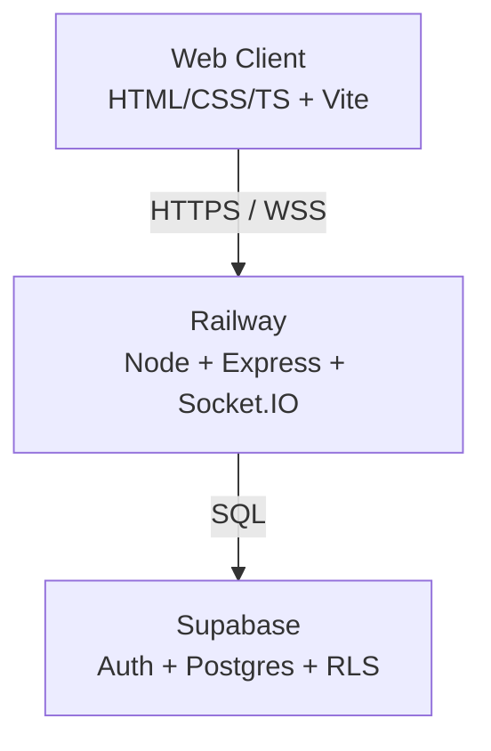
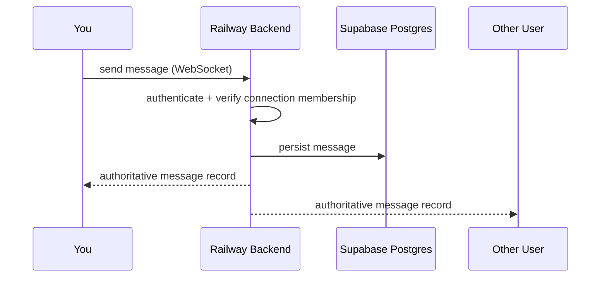
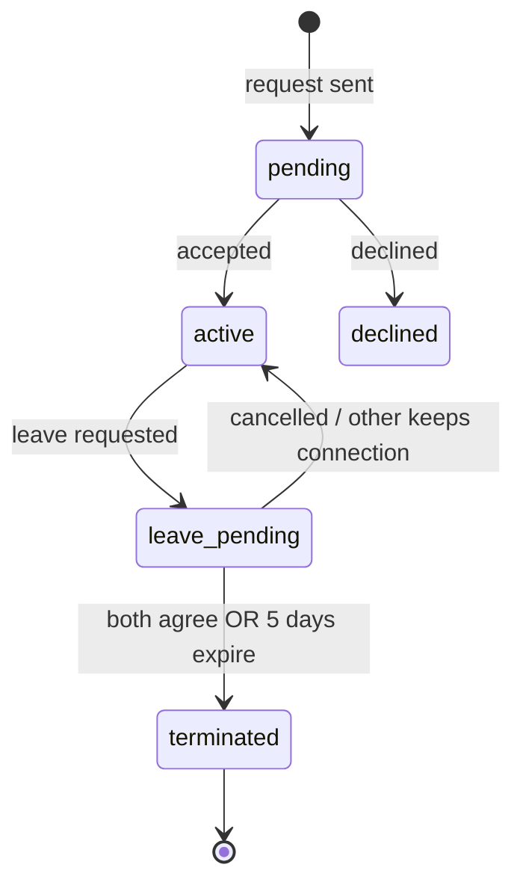
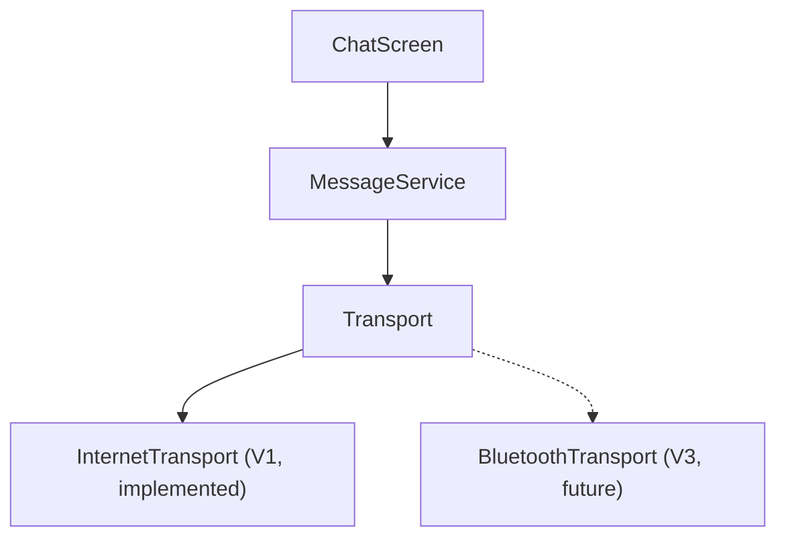

# Architecture

Diagrams updated as the system grows. Additive — don't rewrite existing diagrams from scratch when a phase adds structure, extend them.

## System architecture (V1)

## Message flow (V1)

## Connection state machine

## Transport abstraction

Load-bearing for V3/V4 — every client message path routes through this, not directly through Socket.IO.

