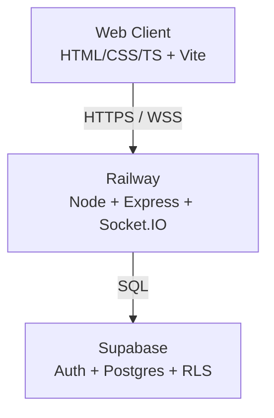
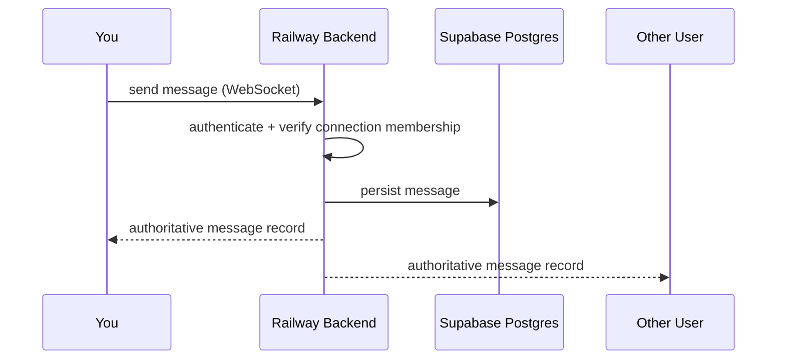
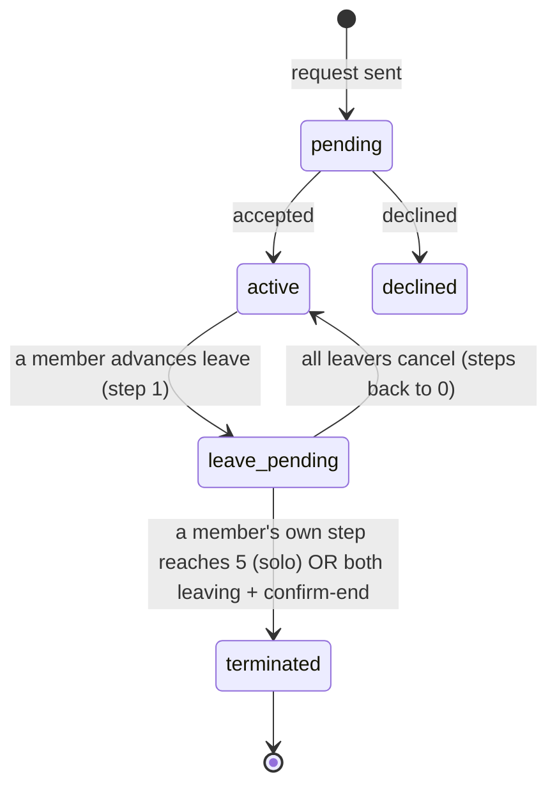
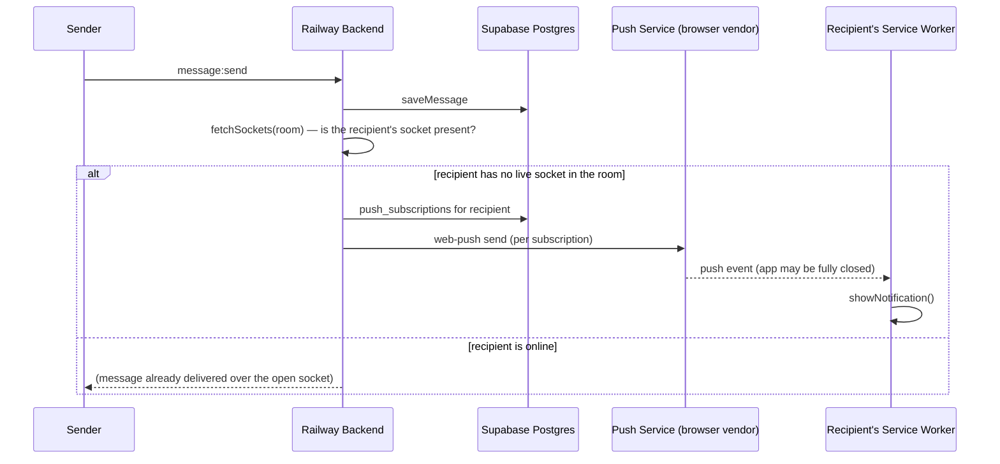
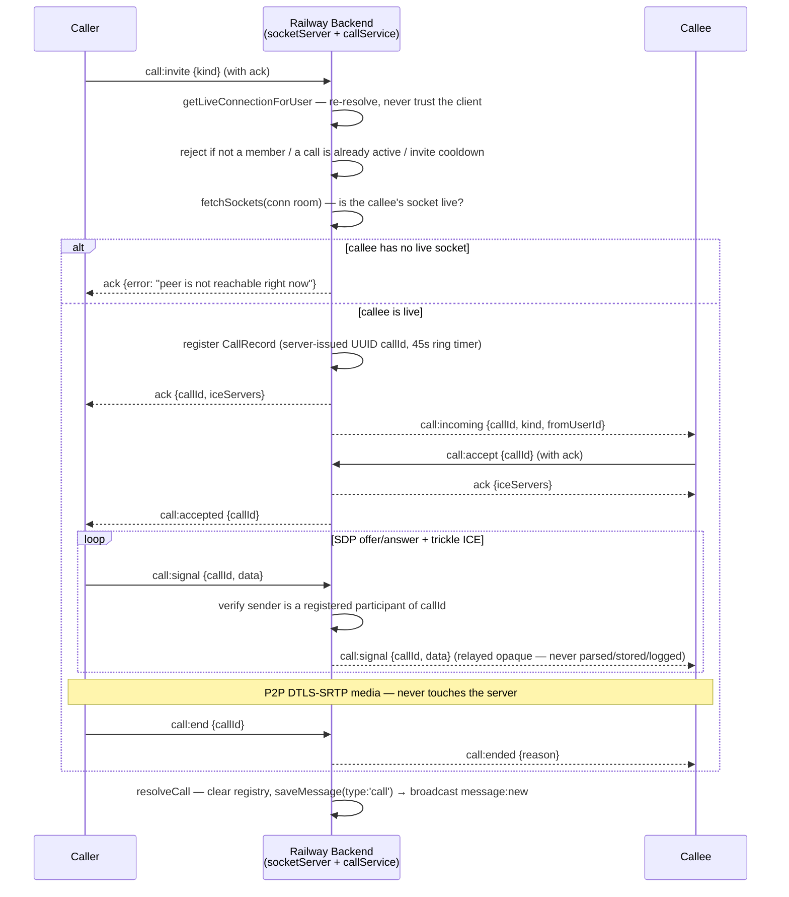
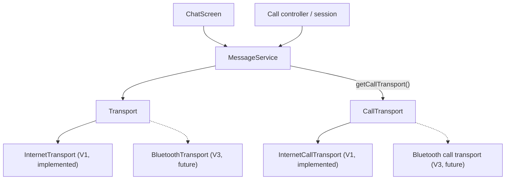

# Architecture

Diagrams updated as the system grows. Additive — don't rewrite existing diagrams from scratch when a phase adds structure, extend them.

## System architecture (V1)

## Message flow (V1)

**Message types (since 2026-08-27):** a message carries `type` (`'text' | 'letter' | 'voice' | 'image' | 'file' | 'ask' | 'countdown' | 'checkin' | 'thisorthat' | 'alarm' | 'call'`) + `payload` (jsonb) alongside `content`. The whole pipeline (`saveMessage` → socket → `Transport.sendMessage(content, type?, payload?)` → `IncomingMessage`/`HistoryMessage` → `appendMessage`) threads these additively, so new types don't re-plumb the flow. **Letters:** body in `content`, `{ appearance, from, to }` in `payload`; rendered as a folded card that opens a styled letter (downloadable as HTML). **Slash commands** (`/letter`, `/countdown`, `/checkin`, `/ask`, `/thisorthat`) live client-side in `features/slashCommands.ts` — `/letter` is the only one that produces a special message via plain text; the rest each open a modal composer. **`countdown`/`checkin`/`ask`/`thisorthat` (since 2026-09-01):** four more keepsake-card types alongside letter, each with its own compose module (`features/countdown.ts`, `features/checkin.ts`, `features/ask.ts`, `features/thisorthat.ts`) mirroring `letters.ts`'s split — feature module owns compose (+ answer modal for ask/thisorthat); `ChatPage.ts`'s `buildMessageRow` owns the inline card (`countdownCard`/`checkinCard`/`askCard`/`thisorthatCard`), same as `letterCard`. **Countdown:** `{label, targetIso}`; the card runs a live `setInterval` ticker that self-clears the first time it finds its own element detached from the DOM (`!card.isConnected`), rather than needing page-level teardown tracking. **Check-in:** `{mood, note}`, mood from a fixed 5-point scale. **Ask:** the mutual sealed-reveal mechanic — sends as two *ordinary* messages, no new live-update path. The sealed original (`{question, answerA}`) renders locked; the recipient's answer sends a second `ask` message reply-linked to the original (`replyTo`) carrying `{question, answerA, answerB}`, which renders revealed. **This or that** (replaces the earlier `/daily` plain-text prompt — a once-a-day command judged too thin to earn its own slash command): the same sealed/revealed shape as ask, but `{optionA, optionB, pickSender}` sealed, `{..., pickRecipient}` revealed — the recipient taps one of the two options (no free text) and both picks render side by side. Both ask and thisorthat reuse the pre-existing generic reply/quote machinery (`buildMessageRow` already appends a quote block for any message with a `replyTo`) instead of mutating the original message or its already-rendered row. All four's own-accent "keepsake card" look (distinct gradient, unflattened in bubble mode) follows `.letter-card`'s established pattern rather than the flattened `.file-card`/`.voice-bubble` one — see the `.letter-card` CSS comment for why the two families diverge. **Alarm (since 2026-09-02):** `/alarm` — same raise/reply shape as ask/thisorthat (no message-mutation path) but warning-red rather than keepsake-styled. Raise carries `{}`; acknowledgement is a second alarm message reply-linked to the raise carrying `{ack:<raiseId>}`, rendered as its own small confirmation card. `features/alarm.ts` owns the in-app alert itself (looping siren `<audio>`, repeating `navigator.vibrate`, a 2min no-ack auto-clear timer) — decoupled from `ChatPage.ts`, which owns the pulsing `.chat--alarm` glow and decides when to call the controller (own send, incoming raise/ack, and a history-load scan that resumes an unacknowledged alarm on reopen). Sound + vibration run until the recipient taps Acknowledge or the 2min auto-clear — being on-screen no longer silences them (the earlier "hybrid clear" made a raise too easy to miss with a glance). Push delivery for a backgrounded/closed app carries an `urgent` flag (`syncDelivery` → `PushPayload` → `sw.js`) enabling `requireInteraction`/`vibrate`/`renotify` — Android-only in practice; iOS PWA push cannot vibrate or play custom audio, and no platform lets web push bypass OS Do Not Disturb. The custom siren itself only ever plays from a live, foregrounded tab (see `docs/PROGRESS.md`'s 2026-09-02 entry for the backgrounded-audio investigation).

**Replies (since 2026-08-27):** `messages.reply_to` (nullable FK to `messages.id`, `on delete set null`) rides the same pipeline — `Transport.sendMessage`'s optional 4th arg, threaded through `saveMessage`/socket/`IncomingMessage`/`HistoryMessage`. The backend re-validates the reply target is a real message in the same connection before storing (never trusts the client id, spec §20). Client-side, `ChatPage.ts` keeps an in-memory `messagesById` map (populated as messages render) to resolve a `reply_to` id into a "sender + snippet" quote block without a re-fetch. Triggering a reply: phone = right-swipe a row; desktop = right-click a row for a small context menu (`.chat__ctx-menu`, via a shared `openPopover()` helper) — the same menu reactions extend with a second "React" item.

**Delivery speed (since 2026-09-03):** text sends were already fully optimistic (client renders before the server round-trip); the socket `message:send` handler's own hot path and the image pipeline were where real latency lived. The sender's `last_read_at` bump (proves the sender has read up to their own message) moved out of `saveMessage` into `bumpSenderLastRead`, called fire-and-forget *after* the broadcast — it no longer gates delivery. For `image`/`voice`/`file` messages, the handler also calls `attachmentService.signAttachments()` before broadcasting and attaches the result as `payload.url`, so both members get a viewable/playable URL in the *same* `message:new` event instead of each independently calling the `/attachments/signed` route the moment they try to render it (that route, `hydrateMedia` in `ChatPage.ts`, remains the fallback for history/legacy messages and for a failed sign). On the sender's own device, `sendImage` runs the local `readImageDimensions` read and the `uploadAttachment` call concurrently, then renders the image bubble immediately from a local object URL (`ImagePayload.localUrl`, client-only, never sent to the server) at the real final size — the row only joins the retry-tracked `pending` queue once the upload actually resolves with a real payload, so a poll/reconnect can't fire a send with no path yet. `imageBubble`'s URL priority is therefore `localUrl` (your own pending send) → `payload.url` (broadcast-signed) → `hydrateMedia` (fallback). The bubble also now reserves the image's box via `aspect-ratio` (falling back to a `min-height` for pre-dimension legacy messages) and shows a spinner over it until the `` fires `load`/`error`, fading in rather than popping in.

**Reactions (since 2026-08-27, overrides spec §29's V1 non-goals — user-confirmed):** a separate `reactions` table (`message_id`, `user_id`, `emoji`, unique per triple) rather than piggybacking on `messages.payload`, since a message can carry many reactions from either member independent of who sent it. Not on the `Transport.sendMessage` path — a parallel `sendReaction`/`onReaction` pair on `Transport`, backed by socket events `reaction:add`/`reaction:remove` → broadcast `reaction:update`. `getHistory` attaches an aggregated `{emoji, userIds}[]` per message (via `reactionService.getReactionsForMessages`); live updates apply to an in-memory `reactionsByMessage` map and re-render just that message's chip row. Triggering: phone = long-press a message bubble; desktop = right-click a row — both open the same menu via the shared `openPopover()` helper. Since 2026-08-29 that helper measures the built menu and clamps it into the visual viewport (8px safe margin, flips above↔below the anchor, repositions on resize, dismisses on scroll) so the picker can never leave the screen or widen the document. The menu carries the 6-emoji row plus **Copy** (text only) and **Report**; desktop also gets **Reply** (phone replies via the right-swipe).

**Message reports (since 2026-08-29):** `message_reports` table (`message_id` nullable + `ON DELETE SET NULL`, `reporter_id`, `reason`, `message_content` snapshot, `unique (message_id, reporter_id)`, RLS enabled). `POST /api/messages/:id/report` (rate-limited) → `reportService.reportMessage`, which verifies the reporter was ever a member of the message's connection (not that it's still active — you report abuse *as* you leave), snapshots the message text, and treats a duplicate as success. No in-app moderation UI in V1 — rows are for manual review; satisfies the Play Store UGC reporting requirement.

**Encryption at rest (since 2026-09-02, Option C — see docs/DECISIONS-encryption-at-rest.md):** `messages.content` and `messages.payload` are stored as application-layer **AES-256-GCM** ciphertext; the key lives only in the backend host env (`ENCRYPTION_KEY_V<n>`), never in the DB or on the client, so a database leak yields ciphertext, not message text. `services/crypto.ts` owns the primitive — envelope `v{N}:base64(iv|tag|ct)` where `v{N}` names a rotatable key (highest configured version = current write key, old versions kept for decrypt), GCM auth tag = tamper detection, fail-fast if unconfigured. `saveMessage` encrypts on write and returns the **in-memory plaintext** `Message`, so the socket broadcast (`message:new`) and push preview are unchanged — only the columns at rest are ciphertext; `getHistory` decrypts on read, passing pre-backfill plaintext rows through untouched (`isEncrypted` guard). `message_reports.message_content` copies the message's stored ciphertext **verbatim** (decrypt-on-review — no second plaintext copy at rest). Migration 026 drops the old plaintext `char_length(content)` check; a one-off `database/backfillEncryption.ts` (dry-run by default, `--apply` to write, idempotent) encrypts pre-existing rows. **Scope:** at-rest-in-our-DB only — NOT E2EE (the backend still reads plaintext to run every §20 check), NOT a full-backend-compromise defense (key + ciphertext both reachable if the host itself is breached). Two deliberate plaintext exits: notification previews (`mediaNoticeFor` sends up to 120 chars of a text message post-decrypt) and attachment bytes (Storage keeps its own disk-at-rest encryption; signed URLs serve them directly, so only their `payload` metadata is encrypted). Rotation constraint: never drop a key version while a report snapshot still references it.

**Hardening (2026-08-29 audit, batches 0–3):** single-active-connection is now enforced by partial unique indexes + an advisory-locked trigger (migration 016), not a racy `count(*)`; `getCurrentConnection` tolerates a stray extra row instead of locking the user out. Connection state transitions (accept / decline / cancel / advance-leave) are conditional updates that pin the from-state. `messages`/`connections` FKs to `users` cascade on delete (migration 017) so accounts can actually be deleted. `getHistory` is paginated newest-first with a `before` cursor. Push endpoints are host-allowlisted (anti-SSRF); connection codes are `crypto.randomInt`; `express-rate-limit` + a per-socket flood guard are in place; socket events re-resolve the caller's live connection per event rather than trusting the handshake value. Client: one reconnecting transport supervisor with ack timeouts and fresh-token socket auth; optimistic sends reconcile on a client `tempId` echoed in `message:new`; `ChatPage` tears down all body-level overlays + their listeners on navigation.

## Connection state machine

Leave model (Stage E) overrides spec §25's passive auto-expire: it is a deliberate, **solo-completable 5-step countdown**, one step per 24h (server-gated), tracked per-member on `connection_members.leave_step` / `leave_last_step_at`. Silence keeps the connection; a member can always exit alone by completing their own 5 steps; when both are leaving, either can `confirm-end` immediately. Chat reflects leave state via a banner + system lines by polling `/connections/current` (leave is connection state, deliberately kept out of the message `Transport`).

**Termination deletes the conversation**: reaching `terminated` deletes the `connections` row, which cascades (`on delete cascade`) to `connection_members` and `messages` — nothing is retained server-side. Participants export (TXT / JSON / HTML) before leaving; the data is theirs.

**Read receipts (WhatsApp 3-state, since 2026-08-31)**: two per-member timestamps on `connection_members`, both surfaced via the same `/connections/current` poll (deliberately off-Transport — connection state, not a message):
- `last_read_at` (migration 008) — bumped by `markRead` (REST `POST /connections/:id/read`, called on load/focus/every visible poll tick). A sender's message is **read** once the other member's `last_read_at ≥ its created_at`.
- `last_delivered_at` (migration 021) — bumped server-side by `markDelivered`, called from two places in `socketServer.ts`: (a) when a member's socket connects/joins the connection room (everything sent so far has now reached their device), and (b) inline on `message:send`, via `syncDelivery`, when the recipient already has a live socket in the room at send time. A sender's message is **delivered** once the other member's `last_delivered_at ≥ its created_at`; **sent** (acked, neither yet) is the remaining case.

Bubble-mode ticks: ✓ sent, ✓✓ gray delivered, ✓✓ light green (`var(--accent-you)`, since 2026-09-01 — WhatsApp's blue blended into this app's own blue "mine" bubble) read.

**Reactions (one per user per message, since 2026-08-31)**: `reactions` unique on `(message_id, user_id)` (migration 022, was `(message_id, user_id, emoji)`) — `reactionService.addReaction`'s upsert conflicts on the pair, so picking a new emoji replaces the user's previous reaction rather than adding a second one. Rendered as a small badge overlapping the message bubble's bottom corner (`.chat__reaction-badge`), not inline with the message content.

## Client appearance (V1, since 2026-08-27)

`features/appearancePreview.ts` persists `{ style, theme }` to localStorage (per-device) and toggles classes/attributes on `.chat` (`applyAppearance`), read by CSS in `styles/global.css`. Bubbles is the default `style`; `theme` (light/dark) only affects bubble-mode colors via `--bubble-mine-*`/`--bubble-other-*` custom properties, scoped under `.chat--bubbles[data-theme='light']`. The composer (`ChatPage.ts`) is a `<textarea>`, not `<input>`, so messages can carry blank-line paragraph gaps; `utils/linkify.ts` turns URLs/phone numbers into `<a>`/`tel:` links via text-node splitting (same XSS-safe pattern as the existing search highlighter).

**Wallpaper is shared, since 2026-08-27** — unlike style/theme, it's `connections.wallpaper` (migration 014), not localStorage: either member's pick applies to both. `appearancePreview.ts` takes it as a param (`applyAppearance(chat, wallpaper)`, `openAppearance(anchor, chat, wallpaper, onWallpaperChange)`) rather than owning it; `ChatPage.ts` applies it optimistically on change via `PATCH /connections/:id/wallpaper` (membership-checked) and re-syncs it off the existing 4s connection poll — no new socket event, reuses the same poll leave-state/read-receipts already ride. `wallpaper: 'love'` serves `client/public/love.jpg` and overrides the bubble palette (colors pulled from the artwork's own palette) so bubbles read against the art. Options are `off` / `love` / `samurai` — a fourth gradient-only option `'1'` was removed 2026-08-31 (migration 023 resets any connection still on it to `off`); the wallpaper system itself is otherwise unchanged.

## Web Push notifications (V1, since 2026-08-27 — inert until keys are set)

A connection's Socket.IO room has exactly its two members, so "any other socket present" is a cheap proxy for "the recipient is here" — no separate presence table. `push_subscriptions` (migration 013) holds one row per device; a 404/410 from the push service prunes it. The client only subscribes when the user toggles **Notifications** in the `•••` menu (`features/pushNotifications.ts`) — never an automatic prompt. Requires `client/public/manifest.webmanifest` + `sw.js` (installable PWA — mandatory for iOS to deliver push at all) and VAPID keys set via env on both sides; unset keys make the backend no-op rather than fail sends.

## Audio + video calling (V1, since 2026-09-04 — overrides spec §29, user-confirmed)

Calls are a §29 V1 non-goal; audio **and video** calling ship as a deliberate, user-confirmed override, the same category as emoji reactions, `/letter`, and image/voice/file media. Video (Batch 7, since 2026-09-04) reuses the entire signaling / call-log / hardening backbone below — it is **client-only**, no schema or backend change (`kind: 'video'` was already threaded through `call:invite`, `CallRecord`, `writeCallLog`, and `notifyMissedCall`).

**Raw WebRTC, signaling over the existing authenticated Socket.IO connection.** Only ever two people, so a 1:1 call is a direct peer-to-peer link — no SFU, no third-party SDK, no media through any server (ours or a vendor's). Media is P2P DTLS-SRTP (mandatory in WebRTC); it is never recorded, transcribed, or relayed. STUN is free/unlimited; **Cloudflare Realtime TURN** (1,000 GB/mo free) relays only the ~10–20% of calls behind symmetric NAT. `services/turnService.ts` + `GET /api/turn-credentials` mint short-TTL credentials backend-side (the long-lived `TURN_KEY_ID` / `TURN_API_TOKEN` never reach the client); unset env vars degrade to STUN-only with a warning rather than break. *Note: as of 2026-09-04 the client actually receives `iceServers` in the `call:invite` / `call:accept` socket acks, and the REST route is unused.*

**Server-side rules, all in `socketServer.ts` / `services/callService.ts`, none in the client:** `callId` is a server-issued UUID; a signal naming any other `callId` than the connection's current active call is rejected (stops replay + cross-connection injection). Only the two registered participants may signal, checked against the in-memory registry, not anything the client sends. One active call per connection — a second invite gets 409. Ring (45s) and give-up timers are server-owned, so a client that goes silent still resolves the call. Live-call state is an in-memory `Map` keyed by connection id (single-instance assumption, same as `lastAlarmRaiseAt`) — nothing about a live call needs to survive a restart.

**Call log:** a `call` message, written **only** by the server (`callService`) — `resolveCall()` at every resolution of a live call (completed / missed / declined / cancelled / failed), plus `inviteCall()` directly for the `unreachable` case (callee's app fully closed, so nothing to ring — since 2026-09-04). The shared `writeCallLog()` helper goes through the normal `saveMessage()`, so `content` (empty) and `payload` (`{ kind, outcome, durationSec }`) are AES-256-GCM encrypted at rest like every other message. `senderId` is always the caller; the client derives incoming/outgoing framing by comparing to its own user id. `message:send` rejects a client-sent `type: 'call'` outright — call history can't be forged. `saveMessage`'s empty-content allowance covers `'call'` beside `'alarm'`. A `missed`/`unreachable` outcome also fires a best-effort web push to the callee (`notifyMissedCall`); `forceEndCall` — the connection-is-being-deleted path — writes its row but suppresses that push (`resolveCall(..., notify: false)`), since the row and the whole conversation cascade away moments later. SDP/ICE blobs (which carry IP addresses) are relayed opaquely and never persisted or logged; the only thing stored is the call-log row.

**Call-log rendering (client, WhatsApp-style since 2026-09-04):** `callLogCard` in `ChatPage.ts` is a normal entry in `buildMessageRow`'s content chain (beside `voiceBubble`/`fileCard`), *not* a special centered row — so it inherits left/right alignment from `[data-mine]` (the caller's own device shows it right/"mine") and, in bubble mode, the wallpaper-tuned `--bubble-*` surface. `.call-log` (disc + title + subtitle, e.g. "Missed voice call" / "Tap to call back") flattens onto the bubble like `.file-card` does. It paints **no colour token of its own** — only `--bubble-*` and translucent scrims — except the missed-call red glyph, which is safe because a "Missed" card only ever renders on the callee's side where the surface is the always-neutral `--bubble-other-bg` (the caller's side of an unanswered call says "No answer"/"Not answered" and stays `currentColor`). Line mode gets a bordered `--bg-raised` row instead. Missed/unreachable rows are tap-to-call-back — they reuse `mountCallBar`'s `startAudioCall` / `startVideoCall` (exposed on the returned `CallBarHandle`, picked by the row's own `kind`), so the capability check, invite cooldown and error surfacing are shared with the header call buttons. Call rows still carry no receipt, reaction or reply.

**Client:** `services/transport/CallTransport.ts` + `InternetCallTransport.ts` mirror the message `Transport` pattern (spec §22) — reached only via `messageService.getCallTransport()`, components never touch Socket.IO. `features/call/session.ts` owns the `RTCPeerConnection` (offer/answer, trickle ICE, ICE-restart on `connectionState` failure with a `reconnecting` state); `features/call/media.ts` is the **single `getUserMedia` chokepoint** + `callingSupported()` secure-context/capability gate (isolated so a native Android permission bridge is a one-file change — see the Android friction list in the plan); `features/call/controller.ts` + `icons.ts` own the header buttons and the full-screen call surface (appended to `document.body`, torn down via `ChatPage`'s disposer list). A connection terminated or a leave completed **mid-call** is torn down by `callService.forceEndCall()`, called from `connectionService.terminate()` through a `setIo()` `ioRef` bridge (that path is outside the socket layer). A socket that (re)connects mid-ring gets `call:incoming` replayed via `getRingingCallForCallee()`.

**Video (Batch 7):** `CallSession` takes a `kind`; for `'video'` it acquires `{ audio, video }` and exposes `onLocalStream`. The full-screen surface gains a full-bleed remote `<video>` (shown once frames arrive — `.call-screen--remote-live`) and a draggable, mirrored local-preview `<video>`; the avatar layout is untouched for audio calls (`.call-screen--video` gates every video style). Camera on/off is `track.enabled` — **never a renegotiation**, so audio is never interrupted; front/back flip is `RTCRtpSender.replaceTrack` with a fresh `getUserMedia`, also renegotiation-free (`media.ts` `hasMultipleCameras()` decides whether the Flip button shows). `features/call/wakeLock.ts` holds a `screen` wake lock for the duration of a video call, re-acquiring on `visibilitychange` (the OS drops it when the tab hides). Missed-video-call rows redial with `startVideoCall`.

**IP exposure is inherent to P2P** — each peer learns the other's IP in a direct connection. For an app whose premise is two people who chose each other this is acceptable, but it is a real property; forcing `iceTransportPolicy: 'relay'` would hide it at the cost of burning the free TURN allowance on every call (possible future privacy toggle, not the default).

**Android:** ringing while the app is closed is not reliably possible on the web platform (no high-priority delivery, no full-screen intent, no ringtone) and **a TWA cannot do it at all** — "the peer's socket is live" is treated as the only reliable ring path; anything else is a missed call + a best-effort push. Speaker/earpiece routing has no web API on Android (the speaker button feature-detects `setSinkId` and hides itself where it can't act). Full friction list in the plan (`~/.claude/plans/query-existing-graph-signaling-socket-adaptive-wren.md`) for the future packaging work.

## Transport abstraction

Load-bearing for V3/V4 — every client message path routes through this, not directly through Socket.IO.

Calling follows the same rule: `features/call/*` never touches Socket.IO — signaling goes through `CallTransport`, reached only via `messageService.getCallTransport()`. A future non-internet transport adds a matching call transport without touching call UI or `CallSession`.
