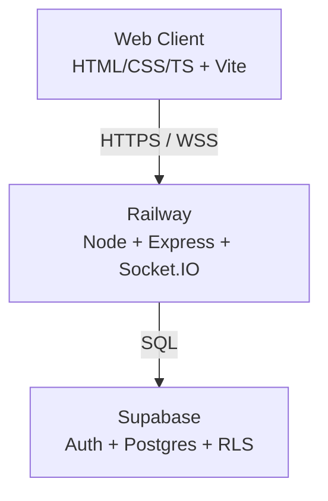
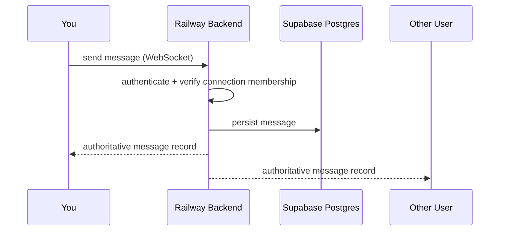
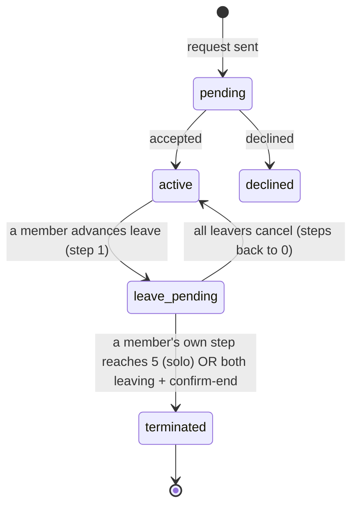
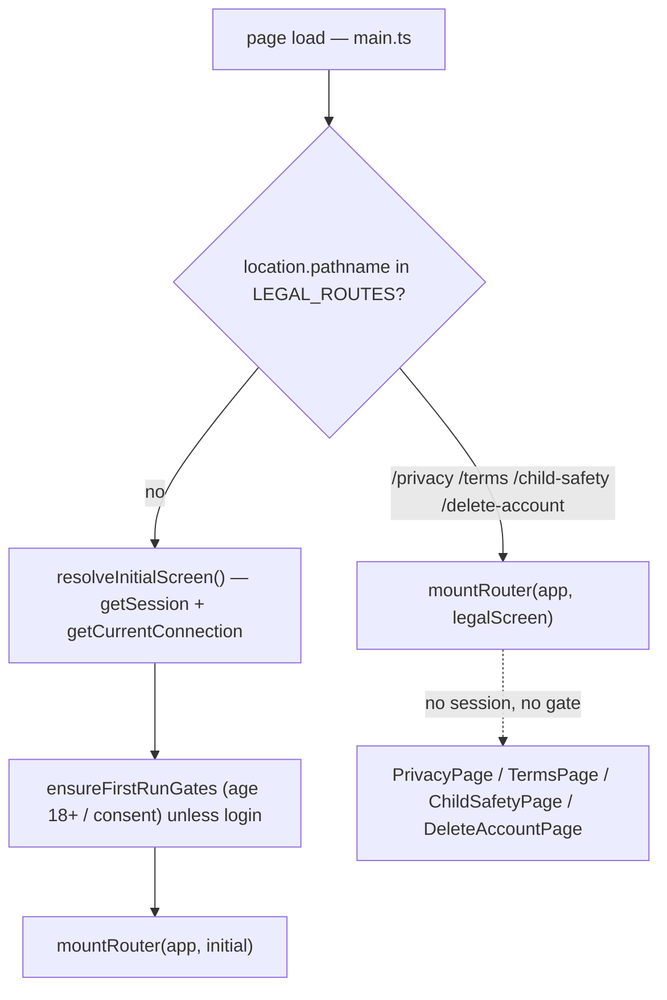
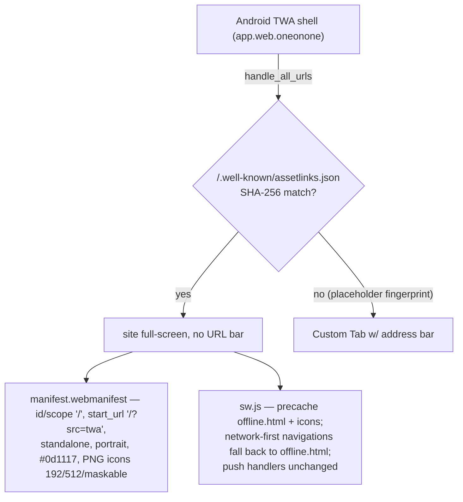
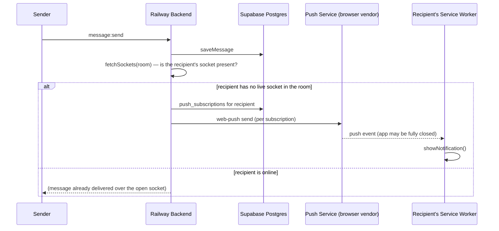
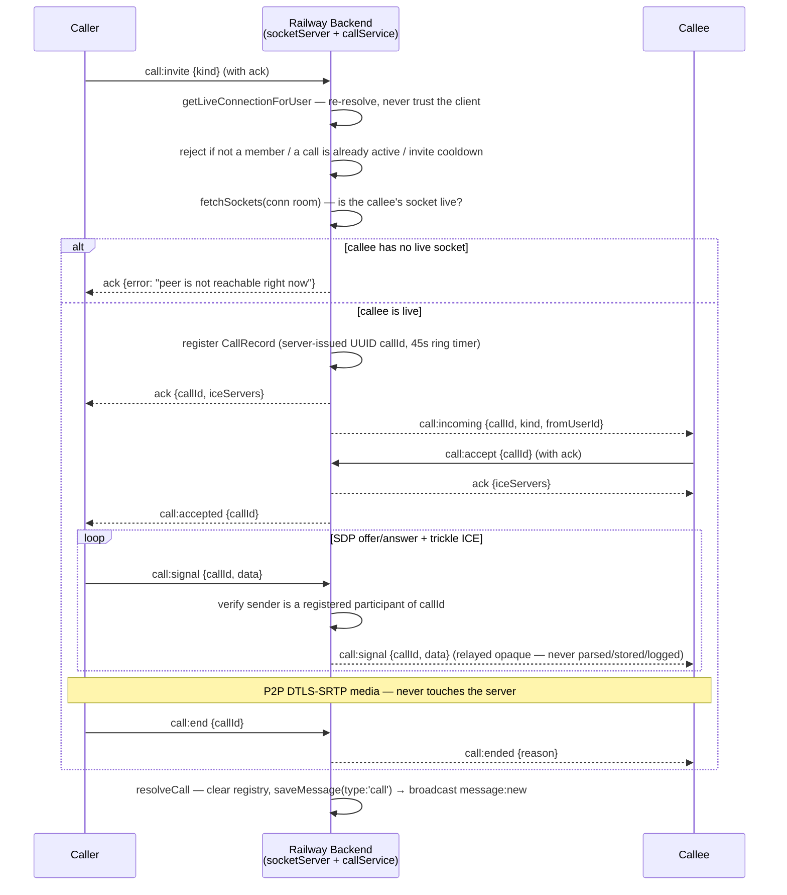
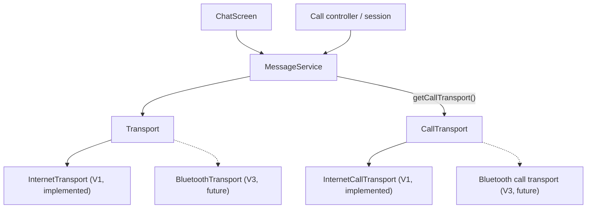

# Architecture

Diagrams updated as the system grows. Additive — don't rewrite existing diagrams from scratch when a phase adds structure, extend them.

## System architecture (V1)



## Message flow (V1)



**Message types (since 2026-08-27):** a message carries `type` (`'text' | 'letter' | 'voice' | 'image' | 'file' | 'ask' | 'countdown' | 'checkin' | 'thisorthat' | 'alarm' | 'call' | 'location'`) + `payload` (jsonb) alongside `content`. The whole pipeline (`saveMessage` → socket → `Transport.sendMessage(content, type?, payload?)` → `IncomingMessage`/`HistoryMessage` → `appendMessage`) threads these additively, so new types don't re-plumb the flow. **Letters:** body in `content`, `{ appearance, from, to }` in `payload`; rendered as a folded card that opens a styled letter (downloadable as HTML). **Slash commands** (`/letter`, `/countdown`, `/checkin`, `/ask`, `/thisorthat`) live client-side in `features/slashCommands.ts` — `/letter` is the only one that produces a special message via plain text; the rest each open a modal composer. **`countdown`/`checkin`/`ask`/`thisorthat` (since 2026-09-01):** four more keepsake-card types alongside letter, each with its own compose module (`features/countdown.ts`, `features/checkin.ts`, `features/ask.ts`, `features/thisorthat.ts`) mirroring `letters.ts`'s split — feature module owns compose (+ answer modal for ask/thisorthat); `ChatPage.ts`'s `buildMessageRow` owns the inline card (`countdownCard`/`checkinCard`/`askCard`/`thisorthatCard`), same as `letterCard`. **Countdown:** `{label, targetIso}`; the card runs a live `setInterval` ticker that self-clears the first time it finds its own element detached from the DOM (`!card.isConnected`), rather than needing page-level teardown tracking. **Check-in:** `{mood, note}`, mood from a fixed 5-point scale. **Ask:** the mutual sealed-reveal mechanic — sends as two *ordinary* messages, no new live-update path. The sealed original (`{question, answerA}`) renders locked; the recipient's answer sends a second `ask` message reply-linked to the original (`replyTo`) carrying `{question, answerA, answerB}`, which renders revealed. **This or that** (replaces the earlier `/daily` plain-text prompt — a once-a-day command judged too thin to earn its own slash command): the same sealed/revealed shape as ask, but `{optionA, optionB, pickSender}` sealed, `{..., pickRecipient}` revealed — the recipient taps one of the two options (no free text) and both picks render side by side. Both ask and thisorthat reuse the pre-existing generic reply/quote machinery (`buildMessageRow` already appends a quote block for any message with a `replyTo`) instead of mutating the original message or its already-rendered row. All four's own-accent "keepsake card" look (distinct gradient, unflattened in bubble mode) follows `.letter-card`'s established pattern rather than the flattened `.file-card`/`.voice-bubble` one — see the `.letter-card` CSS comment for why the two families diverge. **Alarm (since 2026-09-02):** `/alarm` — same raise/reply shape as ask/thisorthat (no message-mutation path) but warning-red rather than keepsake-styled. Raise carries `{}`; acknowledgement is a second alarm message reply-linked to the raise carrying `{ack:<raiseId>}`, rendered as its own small confirmation card. **Sender cancel (since 2026-09-04):** the raiser can also clear their own alarm — same shape, `{ack:<raiseId>, cancelled:true}` — so every existing `payload.ack` consumer (stop sound/vibration/glow, resume-on-reopen, the raise rate-limit) clears it identically; only the rendered label/icon and push preview text distinguish "cancelled" from "acknowledged". `features/alarm.ts` owns the in-app alert itself (looping siren `<audio>`, repeating `navigator.vibrate`, a 2min no-ack auto-clear timer) — decoupled from `ChatPage.ts`, which owns the pulsing `.chat--alarm` glow and decides when to call the controller (own send, incoming raise/ack, and a history-load scan that resumes an unacknowledged alarm on reopen). Sound + vibration run until the recipient taps Acknowledge or the 2min auto-clear — being on-screen no longer silences them (the earlier "hybrid clear" made a raise too easy to miss with a glance). Push delivery for a backgrounded/closed app carries an `urgent` flag (`syncDelivery` → `PushPayload` → `sw.js`) enabling `requireInteraction`/`vibrate`/`renotify` — Android-only in practice; iOS PWA push cannot vibrate or play custom audio, and no platform lets web push bypass OS Do Not Disturb. The custom siren itself only ever plays from a live, foregrounded tab (see `docs/PROGRESS.md`'s 2026-09-02 entry for the backgrounded-audio investigation). **Location (since 2026-09-04):** `/location` — a one-shot snapshot (deliberately not live sharing; no update path exists), `features/location.ts` owns the confirm-before-permission-prompt flow and the `navigator.geolocation.getCurrentPosition` capture (rounded to 5 decimals), `payload` is `{lat, lng, accuracy?}` validated backend-side (`validateLocationPayload`, lat/lng range-checked). `locationCard` in `ChatPage.ts` renders a single OpenStreetMap tile (zoom 15, standard slippy-map tile math, no mapping library) behind a pin, held behind an `IntersectionObserver` so the tile — and the coordinate + IP leak to `tile.openstreetmap.org` that comes with it, independent of the payload's own at-rest encryption — only fires for a card actually scrolled into view (see `docs/DECISIONS-encryption-at-rest.md`'s open decision 3). "Get Directions"/"View" are real `<a>` links to Google Maps (opens the native app on mobile where installed). `mediaNoticeFor` gives it a generic push notice ("shared their location") rather than the default plaintext-content preview, since raw coordinates on a lock-screen notification would be a worse leak than the message itself.

**Linkify (since 2026-08-27, rewritten 2026-09-04):** `utils/linkify.ts`'s `linkifyInto` builds text + `<a>` nodes directly (never `innerHTML`) and is called by every text-bubble render path (message bubble, image/voice caption, check-in note). The 2026-09-04 rewrite widened its regex — bare domains against a curated TLD list (2-letter cc-TLDs require a path) and separator-grouped/bare-10-digit phone numbers as `tel:` links — since the original pattern only matched a scheme URL, a literal `www.`, or an internationally-prefixed (`+`) number.

**Replies (since 2026-08-27):** `messages.reply_to` (nullable FK to `messages.id`, `on delete set null`) rides the same pipeline — `Transport.sendMessage`'s optional 4th arg, threaded through `saveMessage`/socket/`IncomingMessage`/`HistoryMessage`. The backend re-validates the reply target is a real message in the same connection before storing (never trusts the client id, spec §20). Client-side, `ChatPage.ts` keeps an in-memory `messagesById` map (populated as messages render) to resolve a `reply_to` id into a "sender + snippet" quote block without a re-fetch. Triggering a reply: phone = right-swipe a row; desktop = right-click a row for a small context menu (`.chat__ctx-menu`, via a shared `openPopover()` helper) — the same menu reactions extend with a second "React" item.

**Delivery speed (since 2026-09-03):** text sends were already fully optimistic (client renders before the server round-trip); the socket `message:send` handler's own hot path and the image pipeline were where real latency lived. The sender's `last_read_at` bump (proves the sender has read up to their own message) moved out of `saveMessage` into `bumpSenderLastRead`, called fire-and-forget *after* the broadcast — it no longer gates delivery. For `image`/`voice`/`file` messages, the handler also calls `attachmentService.signAttachments()` before broadcasting and attaches the result as `payload.url`, so both members get a viewable/playable URL in the *same* `message:new` event instead of each independently calling the `/attachments/signed` route the moment they try to render it (that route, `hydrateMedia` in `ChatPage.ts`, remains the fallback for history/legacy messages and for a failed sign). On the sender's own device, `sendImage` runs the local `readImageDimensions` read and the `uploadAttachment` call concurrently, then renders the image bubble immediately from a local object URL (`ImagePayload.localUrl`, client-only, never sent to the server) at the real final size — the row only joins the retry-tracked `pending` queue once the upload actually resolves with a real payload, so a poll/reconnect can't fire a send with no path yet. `imageBubble`'s URL priority is therefore `localUrl` (your own pending send) → `payload.url` (broadcast-signed) → `hydrateMedia` (fallback). The bubble also now reserves the image's box via `aspect-ratio` (falling back to a `min-height` for pre-dimension legacy messages) and shows a spinner over it until the `` fires `load`/`error`, fading in rather than popping in.

**Reactions (since 2026-08-27, overrides spec §29's V1 non-goals — user-confirmed):** a separate `reactions` table (`message_id`, `user_id`, `emoji`, unique per triple) rather than piggybacking on `messages.payload`, since a message can carry many reactions from either member independent of who sent it. Not on the `Transport.sendMessage` path — a parallel `sendReaction`/`onReaction` pair on `Transport`, backed by socket events `reaction:add`/`reaction:remove` → broadcast `reaction:update`. `getHistory` attaches an aggregated `{emoji, userIds}[]` per message (via `reactionService.getReactionsForMessages`); live updates apply to an in-memory `reactionsByMessage` map and re-render just that message's chip row. Triggering: phone = long-press a message bubble; desktop = right-click a row — both open the same menu via the shared `openPopover()` helper. Since 2026-08-29 that helper measures the built menu and clamps it into the visual viewport (8px safe margin, flips above↔below the anchor, repositions on resize, dismisses on scroll) so the picker can never leave the screen or widen the document. The menu carries the 6-emoji row plus **Copy** (text only) and **Report**; desktop also gets **Reply** (phone replies via the right-swipe).

**Message reports (since 2026-08-29, hardened 2026-09-09 for Play Store):** `message_reports` table — `message_id` nullable + `ON DELETE SET NULL`, `reporter_id`, `reason` (free-text note), `message_content` snapshot, `unique (message_id, reporter_id)`, RLS enabled. Migration 031 adds `reported_user_id` (nullable, `ON DELETE SET NULL` — the report is moderation evidence that must outlive the reported account, same reasoning as `message_id` in migration 018) and `category` (a coarse bucket: `harassment` / `hate` / `sexual` / `child_safety` / `spam` / `other`; `child_safety` is the CSAE category the Play Child Safety policy requires), plus a partial unique index `(reporter_id, reported_user_id) where message_id is null` for person-level reports. Two entry points, both rate-limited, both verifying the reporter was *ever* a member (report abuse *as* you leave): `POST /api/messages/:id/report` → `reportService.reportMessage` (resolves `reported_user_id` from the message's `sender_id` via `getConnectionByMessageId`, snapshots the ciphertext); `POST /api/connections/:id/report` → `reportConnectionUser` (person-level — no message, `reported_user_id` = the other member, `message_content` null). No in-app moderation UI — `npm run reports:review` (`backend/src/database/reviewReports.ts`) lists reports newest-first and decrypts the snapshot; the human process is `docs/MODERATION.md` (triage SLA, delete-message / end-connection / ban-via-auth-user-delete actions, CSAM → preserve + NCMEC CyberTipline + child-safety point of contact).

**Blocking (since 2026-09-09, Play Store UGC safety):** `blocks` table (migration 030) — `(blocker_user_id, blocked_user_id)` PK, both FKs `on delete cascade`, RLS enabled, backend-only (the client never reads or writes it, spec §20). A block is directional and permanent until the blocker removes it. `POST /api/connections/:id/block` → `connectionService.blockAndTerminate`: writes the block row first (so the guarantee holds even if the next step hiccups), then `terminate()` — **no 5-step countdown**, unlike the deliberate leave model. `requestConnection` calls `blockService.isBlockedBetween` after resolving the target code and throws the same generic enumeration-safe failure as an unknown code if either direction is blocked, so neither side can probe the block. Unblock: `GET`/`DELETE /api/me/blocks[/:blockedUserId]`. Client: `features/blockUser.ts` confirm modal from the chat `•••` menu and `LeavePage`; "Report & block" in the report modal chains `reportConnectionUser` → `blockAndEnd`.

**Account deletion (since 2026-09-09, Play Store policy):** `DELETE /api/me` → `userService.deleteAccount` → best-effort `deleteConnectionAttachments` for the caller's live connection (Storage isn't covered by any FK cascade), then `supabaseAdmin.auth.admin.deleteUser(authUserId)`. That cascades `auth.users` → `users` (migration 001) → `connections` / `messages` / `connection_members` / `reactions` / `push_subscriptions` / `blocks` (all `on delete cascade` off `users(id)`, migrations 017 + 030). `message_reports` *about* the deleted user survive with `reported_user_id` nulled (deliberate evidence retention). Client: `features/deleteAccount.ts` typed confirmation → `signOut()` → Login; reachable from the chat `•••` menu and `ConnectionIdPage` (solo user, no connection).

**First-run gates + permission rationale (since 2026-09-09, Play Store policy):** `features/ageGate.ts` runs from `main.ts` before `mountRouter` for any non-login initial screen — a neutral date-of-birth `<select>` gate (18+ only, which sidesteps the Families Policy; a dead-end screen under 18) followed by a Terms-acceptance checkbox, both persisted per-device in `localStorage` (`ageVerified` / `termsAcceptedAt`) — no server column, matching how appearance prefs are stored. `features/permissionRationale.ts` is a shared pre-prompt modal (mirrors `location.ts`'s `openLocationConfirm`) shown once per kind (`microphone` / `camera` / `notifications`) per session before the browser's own permission prompt — wired into voice recording (`ChatPage`), call start + accept (`call/controller.ts`), and the Notifications toggle.

**Image EXIF strip (since 2026-09-09):** non-GIF images picked for send are re-encoded through a `<canvas>` (`reencodeImage` in `ChatPage.ts`) before upload — this drops EXIF/GPS metadata and yields the dimensions in the same pass. GIFs upload as-is (a canvas re-encode would flatten the animation; they rarely carry location data).

**Encryption at rest (since 2026-09-02, Option C — see docs/DECISIONS-encryption-at-rest.md):** `messages.content` and `messages.payload` are stored as application-layer **AES-256-GCM** ciphertext; the key lives only in the backend host env (`ENCRYPTION_KEY_V<n>`), never in the DB or on the client, so a database leak yields ciphertext, not message text. `services/crypto.ts` owns the primitive — envelope `v{N}:base64(iv|tag|ct)` where `v{N}` names a rotatable key (highest configured version = current write key, old versions kept for decrypt), GCM auth tag = tamper detection, fail-fast if unconfigured. `saveMessage` encrypts on write and returns the **in-memory plaintext** `Message`, so the socket broadcast (`message:new`) and push preview are unchanged — only the columns at rest are ciphertext; `getHistory` decrypts on read, passing pre-backfill plaintext rows through untouched (`isEncrypted` guard). `message_reports.message_content` copies the message's stored ciphertext **verbatim** (decrypt-on-review — no second plaintext copy at rest). Migration 026 drops the old plaintext `char_length(content)` check; a one-off `database/backfillEncryption.ts` (dry-run by default, `--apply` to write, idempotent) encrypts pre-existing rows. **Scope:** at-rest-in-our-DB only — NOT E2EE (the backend still reads plaintext to run every §20 check), NOT a full-backend-compromise defense (key + ciphertext both reachable if the host itself is breached). Two deliberate plaintext exits: notification previews (`mediaNoticeFor` sends up to 120 chars of a text message post-decrypt) and attachment bytes (Storage keeps its own disk-at-rest encryption; signed URLs serve them directly, so only their `payload` metadata is encrypted). Rotation constraint: never drop a key version while a report snapshot still references it.

**Hardening (2026-08-29 audit, batches 0–3):** single-active-connection is now enforced by partial unique indexes + an advisory-locked trigger (migration 016), not a racy `count(*)`; `getCurrentConnection` tolerates a stray extra row instead of locking the user out. Connection state transitions (accept / decline / cancel / advance-leave) are conditional updates that pin the from-state. `messages`/`connections` FKs to `users` cascade on delete (migration 017) so accounts can actually be deleted. `getHistory` is paginated newest-first with a `before` cursor. Push endpoints are host-allowlisted (anti-SSRF); connection codes are `crypto.randomInt`; `express-rate-limit` + a per-socket flood guard are in place; socket events re-resolve the caller's live connection per event rather than trusting the handshake value. Client: one reconnecting transport supervisor with ack timeouts and fresh-token socket auth; optimistic sends reconcile on a client `tempId` echoed in `message:new`; `ChatPage` tears down all body-level overlays + their listeners on navigation.

## Connection state machine



Leave model (Stage E) overrides spec §25's passive auto-expire: it is a deliberate, **solo-completable 5-step countdown**, one step per 24h (server-gated), tracked per-member on `connection_members.leave_step` / `leave_last_step_at`. Silence keeps the connection; a member can always exit alone by completing their own 5 steps; when both are leaving, either can `confirm-end` immediately. Chat reflects leave state via a banner + system lines by polling `/connections/current` (leave is connection state, deliberately kept out of the message `Transport`).

**Termination deletes the conversation**: reaching `terminated` deletes the `connections` row, which cascades (`on delete cascade`) to `connection_members` and `messages` — nothing is retained server-side. Participants export (TXT / JSON / HTML) before leaving; the data is theirs.

**Read receipts (WhatsApp 3-state, since 2026-08-31)**: two per-member timestamps on `connection_members`, both surfaced via the same `/connections/current` poll (deliberately off-Transport — connection state, not a message):
- `last_read_at` (migration 008) — bumped by `markRead` (REST `POST /connections/:id/read`, called on load/focus/every visible poll tick). A sender's message is **read** once the other member's `last_read_at ≥ its created_at`.
- `last_delivered_at` (migration 021) — bumped server-side by `markDelivered`, called from two places in `socketServer.ts`: (a) when a member's socket connects/joins the connection room (everything sent so far has now reached their device), and (b) inline on `message:send`, via `syncDelivery`, when the recipient already has a live socket in the room at send time. A sender's message is **delivered** once the other member's `last_delivered_at ≥ its created_at`; **sent** (acked, neither yet) is the remaining case.

Bubble-mode ticks: ✓ sent, ✓✓ gray delivered, ✓✓ light green (`var(--accent-you)`, since 2026-09-01 — WhatsApp's blue blended into this app's own blue "mine" bubble) read.

**Reactions (one per user per message, since 2026-08-31)**: `reactions` unique on `(message_id, user_id)` (migration 022, was `(message_id, user_id, emoji)`) — `reactionService.addReaction`'s upsert conflicts on the pair, so picking a new emoji replaces the user's previous reaction rather than adding a second one. Rendered as a small badge overlapping the message bubble's bottom corner (`.chat__reaction-badge`), not inline with the message content.

## Client appearance (V1, since 2026-08-27)

`features/appearancePreview.ts` persists `{ style, theme }` to localStorage (per-device) and toggles classes/attributes on `.chat` (`applyAppearance`), read by CSS in `styles/global.css`. Bubbles is the default `style`; `theme` (light/dark) only affects bubble-mode colors via `--bubble-mine-*`/`--bubble-other-*` custom properties, scoped under `.chat--bubbles[data-theme='light']`. The composer (`ChatPage.ts`) is a `<textarea>`, not `<input>`, so messages can carry blank-line paragraph gaps; `utils/linkify.ts` turns URLs/phone numbers into `<a>`/`tel:` links via text-node splitting (same XSS-safe pattern as the existing search highlighter).

**Wallpaper is shared, since 2026-08-27** — unlike style/theme, it's `connections.wallpaper` (migration 014), not localStorage: either member's pick applies to both. `appearancePreview.ts` takes it as a param (`applyAppearance(chat, wallpaper)`, `openAppearance(anchor, chat, wallpaper, onWallpaperChange)`) rather than owning it; `ChatPage.ts` applies it optimistically on change via `PATCH /connections/:id/wallpaper` (membership-checked) and re-syncs it off the existing 4s connection poll — no new socket event, reuses the same poll leave-state/read-receipts already ride. `wallpaper: 'love'` serves `client/public/love.jpg` and overrides the bubble palette (colors pulled from the artwork's own palette) so bubbles read against the art. Options are `off` / `love` / `samurai` — a fourth gradient-only option `'1'` was removed 2026-08-31 (migration 023 resets any connection still on it to `off`); the wallpaper system itself is otherwise unchanged.

## Public routes (V1, since 2026-09-09 — Play Store Stage 2)

The client router (`state/router.ts`) is a screen-name state machine with no URL
awareness — `main.ts` calls `resolveInitialScreen()` (session + current
connection) and mounts one screen; navigation is `go(screen)`, the path never
changes. Google Play requires publicly reachable legal pages, so four routes are
matched *by path* as a special case, ahead of that flow:



`pages/legalShared.ts` is the single source: identity constants (developer name,
contact + child-safety email, jurisdiction — from `docs/_playstore-inputs.md`),
`legalShell()` chrome, `wireLegalBack()` (`history.back()` or `/`), and the three
content bodies. `DeleteAccountPage` is the one interactive page — it calls
`getSession()` and either runs the Stage 1 `deleteAccount()` + `signOut()` flow
(typed-"delete" confirm) or shows a sign-in prompt. `{{DOMAIN}}` stays a literal
token in the copy until a custom domain exists.

`client/public/legal/{privacy,terms,child-safety}.html` are self-contained
mirrors (own palette + `prefers-color-scheme`) for any external link that can't
run the SPA — e.g. the Play Console privacy-policy URL. They must be kept in sync
with `legalShared.ts` by hand (cross-referenced in comments). `client/vercel.json`
(Stage 3) excludes `/legal/*` and `/.well-known/*` from the SPA rewrite.

Links in: Login footer (`.screen__legal`), the age-gate consent line (Stage 1),
and the chat `•••` menu "ABOUT" group (`MenuDropdown.ts`, new tab).

## PWA / TWA packaging (V1, since 2026-09-09 — Play Store Stages 3–4)

The Android app is the deployed site (`https://one-on-one-mu.vercel.app/`) wrapped
as a **Trusted Web Activity** via Bubblewrap (plan
`~/.claude/plans/ancient-weaving-raven.md` Part 1 — no native logic, Chrome
mediates every browser API the app uses). Stage 3 makes the site meet the PWA bar
a TWA needs:



- **Icons** are rasterized from `client/public/icon.svg` by `scripts/gen-icons.mjs`
  (`npm run gen-icons`, sharp): web set (192, 512 any, 512 maskable padded to the
  80% safe zone) → `client/public/icons/`; Play listing icon + feature graphic →
  `docs/playstore/store-assets/` (not served from the site). First-pass art.
- **Fonts** are self-hosted — `scripts/vendor-fonts.mjs` vendors the Fraunces /
  Figtree / JetBrains Mono faces (latin + latin-ext) into `client/public/fonts/`
  + a generated `fonts.css`; `index.html` links that instead of Google Fonts,
  removing the IP-on-load third party.
- **`client/vercel.json`** — SPA rewrite excluding `/.well-known/*`, `/legal/*`
  and the static asset dirs; `application/json` on `assetlinks.json`; baseline
  security headers + a CSP allowing self + Supabase + Railway (`connect-src`
  wildcards — tighten to the exact backend origin once the domain is final).
- **`assetlinks.json`** carries the upload-key SHA-256 (verifies sideloaded
  builds); the Play App Signing SHA-256 is appended as a second array entry
  after the first AAB upload (plan Part 5 step 11).
- Node pinned to 24 (`.nvmrc` + `engines`, root and `client/`).

**Stage 4 — the Android project.** `android/twa-manifest.json` is the
hand-authored Bubblewrap config (no local `bubblewrap init` was run — this env
has no JDK 17 / Android SDK): `packageId app.web.oneonone`, `host`
`one-on-one-mu.vercel.app`, `startUrl /?src=twa`, standalone/portrait, `#0d1117`,
`enableNotifications` (Chrome push delegation), `fallbackType customtabs`,
`minSdkVersion 21`. `.github/workflows/android-build.yml` builds the signed `.aab`
on a runner (`workflow_dispatch`) — first run generates the upload keystore and
prints its passwords to the job summary; later runs reuse it from repo secrets
(`ANDROID_KEYSTORE_BASE64` / `_PASSWORD` / `ANDROID_KEY_PASSWORD`). Play App
Signing holds the real distribution key. Full runbook + the Asset Links ordering
dance: `docs/playstore/ANDROID_BUILD.md`. The generated Gradle project
(`android/app/`), the keystore, and `*.aab` are gitignored.

**Stage 5 — console-ready package.** `docs/playstore/` holds the transcribe-ready
Play Console inputs: `DATA_SAFETY.md`, `CONTENT_RATING.md` (IARC), `STORE_LISTING.md`,
`REVIEWER_NOTES.md` (the app is fully behind OAuth — the reviewer needs two
pre-paired demo accounts), `PUBLISH_CHECKLIST.md` (the ordered personal-action
list), and `screenshots/` (captured by `scripts/shoot-screenshots.mjs` —
interactive, not headless, because of the OAuth wall).

### Capacitor migration (since 2026-09-10 — supersedes the TWA)

The Android wrapper is moving from the Bubblewrap TWA (which runs inside Chrome's
process and inherits Chrome-level settings) to a **Capacitor** native WebView
shell with its own process identity, data directory, and permissions. Plan +
staged breakdown: `~/.claude/plans/pr-63-is-merged-radiant-dragon.md`.

- **Stage 1 (PR #65):** committed Capacitor Gradle project at repo-root
  `android/` (Capacitor 8, minSdk 24, target/compileSdk 36); `client/capacitor.config.ts`
  (`appId app.web.oneonone`, `webDir dist`, `androidScheme https` → served from
  `https://localhost`, a secure context). CSP mirrored from `vercel.json` into an
  `index.html` `<meta>` (no Vercel headers on the native origin); `https://localhost`
  added to the backend CORS allowlist (Express + Socket.IO); service-worker
  registration skipped when `Capacitor.isNativePlatform()`.
- **Stage 2 (PR #66):** Google sign-in. Google blocks OAuth redirects in embedded
  WebViews, so `authService.signInWithGoogle()` branches: web keeps
  `signInWithOAuth`; native dynamic-imports `services/nativeGoogleAuth.ts`, which
  uses **Android Credential Manager** (`@capgo/capacitor-social-login`, Google
  provider only) → Google ID token → `supabase.auth.signInWithIdToken`. Nonce:
  raw `crypto.randomUUID()` to Supabase, its SHA-256 hex to Google (the ID
  token's `nonce` claim); Supabase re-hashes and compares. The *Web* OAuth client
  ID is the token audience even on Android (hardcoded public value, overridable
  via `VITE_GOOGLE_WEB_CLIENT_ID`); the *Android* OAuth client is matched
  by the OS from the APK signature, never referenced in code. The dynamic import
  keeps the plugin out of the web bundle's initial load. `main.ts` is unchanged —
  its redirect-handling code is an inert no-op on native.
- **Stage 2 bugfix (branch `capacitor/stage-2-fix-signing`):** the plugin
  launches Google's scope-consent screen with `Activity.startIntentSenderForResult`
  (request codes `583892990..+128`), outside the Capacitor bridge. `MainActivity`
  now implements `ModifiedMainActivityForSocialLoginPlugin` and forwards that
  request-code range from `onActivityResult` to
  `SocialLoginPlugin.handleGoogleLoginIntent`; without it the plugin's internal
  future never completes and `login()` hangs after consent. Flow:
  Credential Manager → consent Activity → `MainActivity.onActivityResult` →
  `SocialLoginPlugin` → JS promise resolves → `signInWithIdToken`.
- **Backend origin on native:** the shell is served from `https://localhost`, but
  `VITE_API_URL` must still resolve to the deployed Railway backend. `client/.env`
  holds the dev value (`http://localhost:3000`) and Vite loads `.env` in *every*
  mode, so a committed `client/.env.production` (un-ignored in
  `client/.gitignore`, public values only) overrides it for `npm run build` —
  which is what `npx cap sync` copies into the APK. On Vercel the project env var
  still wins over both. Consumed by `services/apiClient.ts` (REST) and
  `services/transport/InternetTransport.ts` (Socket.IO); both origins are already
  in the `connect-src` allowlist (`https://*.up.railway.app`,
  `wss://*.up.railway.app`), and the backend CORS allowlist pins `https://localhost`.
- **Post-sign-in routing:** web relies on the OAuth redirect reloading the page
  to re-run `main.ts`'s boot resolution. Native has no reload, so
  `signInWithGoogle()` reports whether a session now exists in-page and
  `LoginPage` calls `state/boot.ts` → `goToPostSignInScreen(root, go)`, which
  re-resolves the screen, applies the first-run age/Terms gate and drives the
  router's existing `go()`. `resolveScreenForSession()` is shared by both paths
  so cold boot and post-sign-in can't drift apart.
- **Stage 3 — call foreground service (branch
  `capacitor/stage-3-call-foreground-service`):** the TWA kept an active call's
  media alive by inheriting Chrome's living process; the WebView shell has no such
  process, so a backgrounded call froze within seconds. Restored with a foreground
  service:

  ```
  controller.ts (ringing-out / accept → in-call)
      │  startCallService(kind) / stopCallService()  [no-op off native, errors swallowed]
      ▼
  client/src/services/callForegroundService.ts
      │  Capacitor plugin bridge  ("CallService")
      ▼
  CallServicePlugin.java  (start / stop, idempotent; requests POST_NOTIFICATIONS on API 33+)
      │  ContextCompat.startForegroundService / ACTION_STOP
      ▼
  CallForegroundService.java  (foregroundServiceType=phoneCall, START_NOT_STICKY,
      low-importance "calls" channel, ongoing CATEGORY_CALL notification → MainActivity)
  ```

  It exists purely to keep the process + WebRTC media alive while backgrounded —
  no ConnectionService, no native call UI. The `phoneCall` service type is
  unlocked by declaring `MANAGE_OWN_CALLS` (normal / install-time, no runtime
  prompt) in the manifest. `CAMERA` / `RECORD_AUDIO` / `MODIFY_AUDIO_SETTINGS`
  declarations let Capacitor's `BridgeWebChromeClient` auto-grant the WebRTC
  getUserMedia prompts. Started on `ringing-out` and on incoming-accept, stopped
  in `controller.ts`'s `reset()` / `dispose()` chokepoints. Not started for
  `ringing-in` (no media held before accept); FCM call-wake and native
  incoming-call UI are out of scope.
  - `ACCESS_FINE_LOCATION` + `ACCESS_COARSE_LOCATION` are also declared — the
    `/location` feature's `navigator.geolocation` call is bridged by the same
    `BridgeWebChromeClient` (`onGeolocationPermissionsShowPrompt`, which requests
    both). Without the manifest entries Android silent-denies and no dialog shows.
  - Remote video attach: Android System WebView doesn't repaint a `<video>` when
    a track is added to an already-bound `MediaStream`, so `controller.ts`'s
    `onRemoteStream` re-binds a fresh `MediaStream` when the remote track set
    changes (the remote peer sends audio then video). Desktop Chrome never hit
    this — its media-element load algorithm re-runs on track add.
- **Stage 4 — FCM push (branch `capacitor/stage-4-fcm`):** the PWA's Web
  Push / VAPID path needs a service worker, which the WebView never registers, so
  the native build had no push. FCM replaces it on native; the web PWA keeps
  web-push. **Both transports coexist** — `pushService.sendToUser()` fans out to
  `push_subscriptions` (web-push) *and* `push_tokens` (FCM), each gated by its own
  keys.

  ```
  ChatPage "Notifications" toggle
      │  isPushSupported()  → true on web (VAPID) AND on native (Capacitor)
      ▼
  features/pushNotifications.ts        ── isNative? ──┐
      │ web: PushManager.subscribe                    │ native: @capacitor/push-notifications
      │   POST /api/push/subscribe                    │   register() → token
      │   {endpoint, keys}                            │   POST /api/push/token  {token}
      ▼                                               ▼
  push_subscriptions                              push_tokens  (migration 032)
      ▲                                               ▲
      │ web-push (VAPID)                               │ FCM HTTP v1
      │                                               │   OAuth2 JWT-bearer from
  pushService.sendWebPushToUser()                 pushService.sendFcmToUser()
      │   prune 404/410                                │   prune UNREGISTERED / INVALID_ARGUMENT
      └───────────────── sendToUser(userId, {title, body, urgent?}) ─────────────────┘
                    (socketServer.ts new-message · callService.ts missed-call — unchanged)
  ```

  Backend auth is `FIREBASE_SERVICE_ACCOUNT` (whole service-account JSON in one
  env var); the access token is minted with hand-rolled RS256 (`node:crypto`),
  no `googleapis` dep. Android: `com.google.gms.google-services` Gradle plugin was
  already in the Capacitor 8 template, guarded on `google-services.json` (gitignored,
  user-supplied). Notification channel `messages` (importance HIGH) is separate
  from Stage 3's low-importance `calls` channel. `@capacitor/push-notifications`
  owns the `POST_NOTIFICATIONS` runtime prompt; `CallServicePlugin` self-defers
  (it only asks at call-start if not already granted). **Still out of scope:** FCM
  call-wake / native incoming-call UI — messages + missed calls only.

TWA artifacts (`twa-manifest.json`, `android-build.yml`, `assetlinks.json`) stay
in place until Stage 6 rewrites the build pipeline for Gradle.

## Web Push notifications (V1, since 2026-08-27 — inert until keys are set)



A connection's Socket.IO room has exactly its two members, so "any other socket present" is a cheap proxy for "the recipient is here" — no separate presence table. `push_subscriptions` (migration 013) holds one row per device; a 404/410 from the push service prunes it. The client only subscribes when the user toggles **Notifications** in the `•••` menu (`features/pushNotifications.ts`) — never an automatic prompt. Requires `client/public/manifest.webmanifest` + `sw.js` (installable PWA — mandatory for iOS to deliver push at all) and VAPID keys set via env on both sides; unset keys make the backend no-op rather than fail sends.

This diagram describes the **web PWA** path only. Since the Capacitor migration's Stage 4 the **native Android** build uses FCM instead (no service worker in the WebView) — `push_tokens` + `pushService.sendFcmToUser()`, see the Capacitor migration section above. `sendToUser()` fans out to both; both send call sites and the payload shape are shared and unchanged.

## Audio + video calling (V1, since 2026-09-04 — overrides spec §29, user-confirmed)

Calls are a §29 V1 non-goal; audio **and video** calling ship as a deliberate, user-confirmed override, the same category as emoji reactions, `/letter`, and image/voice/file media. Video (Batch 7, since 2026-09-04) reuses the entire signaling / call-log / hardening backbone below — it is **client-only**, no schema or backend change (`kind: 'video'` was already threaded through `call:invite`, `CallRecord`, `writeCallLog`, and `notifyMissedCall`).

**Raw WebRTC, signaling over the existing authenticated Socket.IO connection.** Only ever two people, so a 1:1 call is a direct peer-to-peer link — no SFU, no third-party SDK, no media through any server (ours or a vendor's). Media is P2P DTLS-SRTP (mandatory in WebRTC); it is never recorded, transcribed, or relayed. STUN is free/unlimited; **Cloudflare Realtime TURN** (1,000 GB/mo free) relays only the ~10–20% of calls behind symmetric NAT. `services/turnService.ts` + `GET /api/turn-credentials` mint short-TTL credentials backend-side (the long-lived `TURN_KEY_ID` / `TURN_API_TOKEN` never reach the client); unset env vars degrade to STUN-only with a warning rather than break. *Note: as of 2026-09-04 the client actually receives `iceServers` in the `call:invite` / `call:accept` socket acks, and the REST route is unused.*



**Server-side rules, all in `socketServer.ts` / `services/callService.ts`, none in the client:** `callId` is a server-issued UUID; a signal naming any other `callId` than the connection's current active call is rejected (stops replay + cross-connection injection). Only the two registered participants may signal, checked against the in-memory registry, not anything the client sends. One active call per connection — a second invite gets 409. Ring (45s) and give-up timers are server-owned, so a client that goes silent still resolves the call. Live-call state is an in-memory `Map` keyed by connection id (single-instance assumption, same as `lastAlarmRaiseAt`) — nothing about a live call needs to survive a restart.

**Call log:** a `call` message, written **only** by the server (`callService`) — `resolveCall()` at every resolution of a live call (completed / missed / declined / cancelled / failed), plus `inviteCall()` directly for the `unreachable` case (callee's app fully closed, so nothing to ring — since 2026-09-04). The shared `writeCallLog()` helper goes through the normal `saveMessage()`, so `content` (empty) and `payload` (`{ kind, outcome, durationSec }`) are AES-256-GCM encrypted at rest like every other message. `senderId` is always the caller; the client derives incoming/outgoing framing by comparing to its own user id. `message:send` rejects a client-sent `type: 'call'` outright — call history can't be forged. `saveMessage`'s empty-content allowance covers `'call'` beside `'alarm'`. A `missed`/`unreachable` outcome also fires a best-effort web push to the callee (`notifyMissedCall`); `forceEndCall` — the connection-is-being-deleted path — writes its row but suppresses that push (`resolveCall(..., notify: false)`), since the row and the whole conversation cascade away moments later. SDP/ICE blobs (which carry IP addresses) are relayed opaquely and never persisted or logged; the only thing stored is the call-log row.

**Call-log rendering (client, WhatsApp-style since 2026-09-04):** `callLogCard` in `ChatPage.ts` is a normal entry in `buildMessageRow`'s content chain (beside `voiceBubble`/`fileCard`), *not* a special centered row — so it inherits left/right alignment from `[data-mine]` (the caller's own device shows it right/"mine") and, in bubble mode, the wallpaper-tuned `--bubble-*` surface. `.call-log` (disc + title + subtitle, e.g. "Missed voice call" / "Tap to call back") flattens onto the bubble like `.file-card` does. It paints **no colour token of its own** — only `--bubble-*` and translucent scrims — except the missed-call red glyph, which is safe because a "Missed" card only ever renders on the callee's side where the surface is the always-neutral `--bubble-other-bg` (the caller's side of an unanswered call says "No answer"/"Not answered" and stays `currentColor`). Line mode gets a bordered `--bg-raised` row instead. Missed/unreachable rows are tap-to-call-back — they reuse `mountCallBar`'s `startAudioCall` / `startVideoCall` (exposed on the returned `CallBarHandle`, picked by the row's own `kind`), so the capability check, invite cooldown and error surfacing are shared with the header call buttons. Call rows still carry no receipt, reaction or reply.

**Client:** `services/transport/CallTransport.ts` + `InternetCallTransport.ts` mirror the message `Transport` pattern (spec §22) — reached only via `messageService.getCallTransport()`, components never touch Socket.IO. `features/call/session.ts` owns the `RTCPeerConnection` (offer/answer, trickle ICE, ICE-restart on `connectionState` failure with a `reconnecting` state); `features/call/media.ts` is the **single `getUserMedia` chokepoint** + `callingSupported()` secure-context/capability gate (isolated so a native Android permission bridge is a one-file change — see the Android friction list in the plan); `features/call/controller.ts` + `icons.ts` own the header buttons and the full-screen call surface (appended to `document.body`, torn down via `ChatPage`'s disposer list). A connection terminated or a leave completed **mid-call** is torn down by `callService.forceEndCall()`, called from `connectionService.terminate()` through a `setIo()` `ioRef` bridge (that path is outside the socket layer). A socket that (re)connects mid-ring gets `call:incoming` replayed via `getRingingCallForCallee()`.

**Video (Batch 7):** `CallSession` takes a `kind`; for `'video'` it acquires `{ audio, video }` and exposes `onLocalStream`. The full-screen surface gains a full-bleed remote `<video>` (shown once frames arrive — `.call-screen--remote-live`) and a draggable, mirrored local-preview `<video>`; the avatar layout is untouched for audio calls (`.call-screen--video` gates every video style). Camera on/off is `track.enabled` — **never a renegotiation**, so audio is never interrupted; front/back flip is `RTCRtpSender.replaceTrack` with a fresh `getUserMedia`, also renegotiation-free (`media.ts` `hasMultipleCameras()` decides whether the Flip button shows). `features/call/wakeLock.ts` holds a `screen` wake lock for the duration of a video call, re-acquiring on `visibilitychange` (the OS drops it when the tab hides). Missed-video-call rows redial with `startVideoCall`.

**IP exposure is inherent to P2P** — each peer learns the other's IP in a direct connection. For an app whose premise is two people who chose each other this is acceptable, but it is a real property; forcing `iceTransportPolicy: 'relay'` would hide it at the cost of burning the free TURN allowance on every call (possible future privacy toggle, not the default).

**Android:** ringing while the app is closed is not reliably possible on the web platform (no high-priority delivery, no full-screen intent, no ringtone) and **a TWA cannot do it at all** — "the peer's socket is live" is treated as the only reliable ring path; anything else is a missed call + a best-effort push. Speaker/earpiece routing has no web API on Android (the speaker button feature-detects `setSinkId` and hides itself where it can't act). Full friction list in the plan (`~/.claude/plans/query-existing-graph-signaling-socket-adaptive-wren.md`) for the future packaging work.

**Audio quality + call bar layout fixes (since 2026-09-04):** the remote `<audio>` element (audio calls only — the video path already did this) now has `.play()` explicitly called with a surfaced-toast failure path, and is reused rather than recreated on a repeat `onRemoteStream` fire (per-track, or after an ICE restart) — previously each fire silently orphaned the prior element. `media.ts`'s mic constraint widened from bare `audio: true` to explicit `echoCancellation`/`noiseSuppression`/`autoGainControl`. iOS Safari's earpiece-routing during active mic capture (no web API to force the loudspeaker) is a documented platform limitation, not something either fix touches — same honest treatment as the Android speaker-toggle gap above. Separately, `.call-screen__controls` now lets its 5 control items (`flex: 1 1 0; min-width: 0`) actually shrink instead of overflowing the rounded panel on a narrow phone — a fixed 62px-per-button layout needed more width than a 390px viewport's control bar had once video added the Camera/Flip buttons.

## Transport abstraction

Load-bearing for V3/V4 — every client message path routes through this, not directly through Socket.IO.



Calling follows the same rule: `features/call/*` never touches Socket.IO — signaling goes through `CallTransport`, reached only via `messageService.getCallTransport()`. A future non-internet transport adds a matching call transport without touching call UI or `CallSession`.
