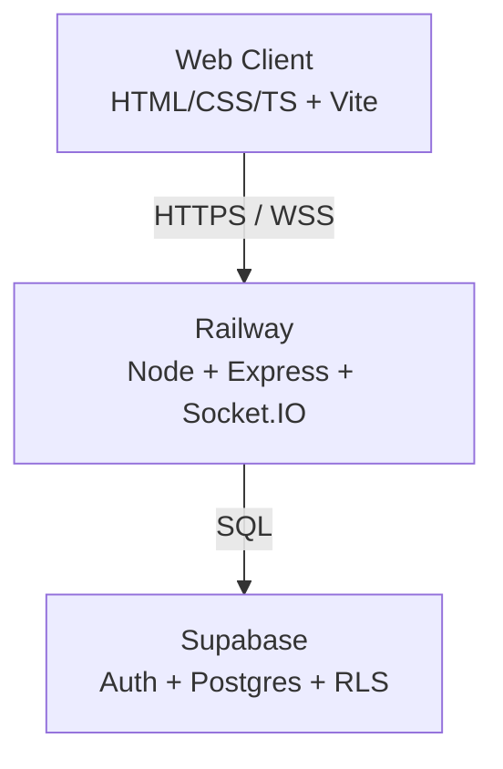
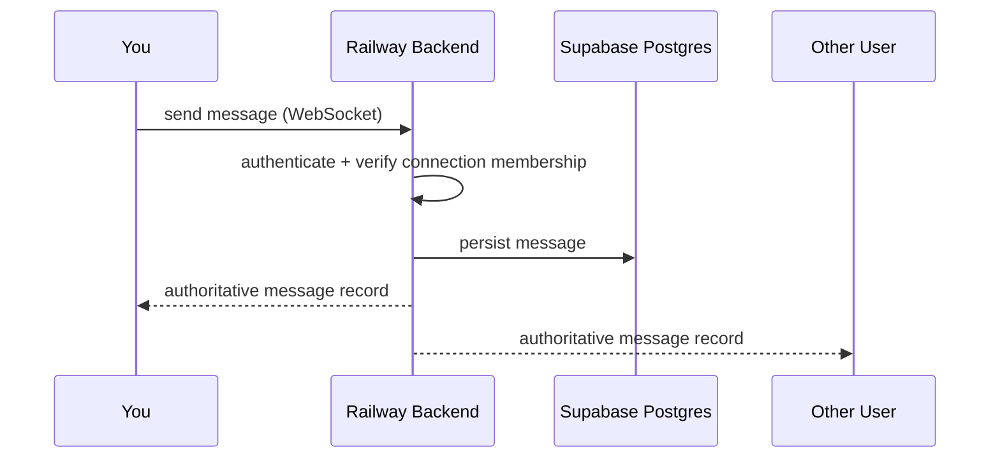
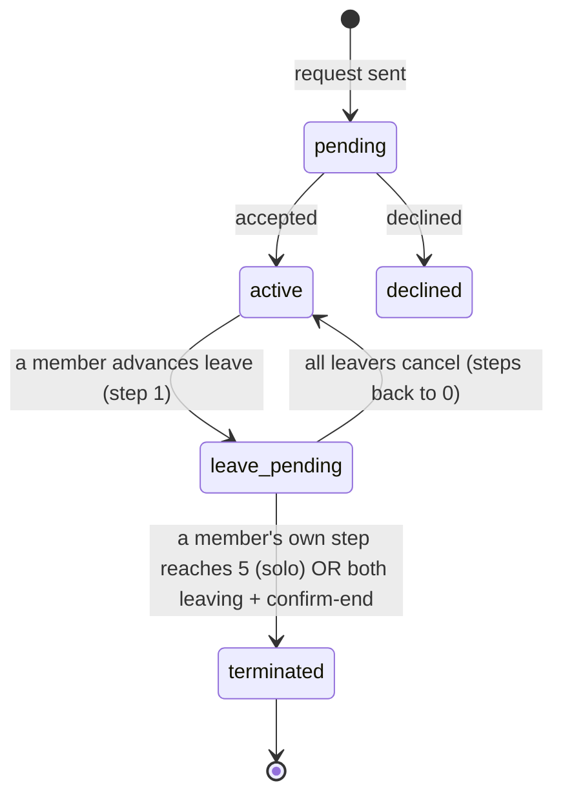
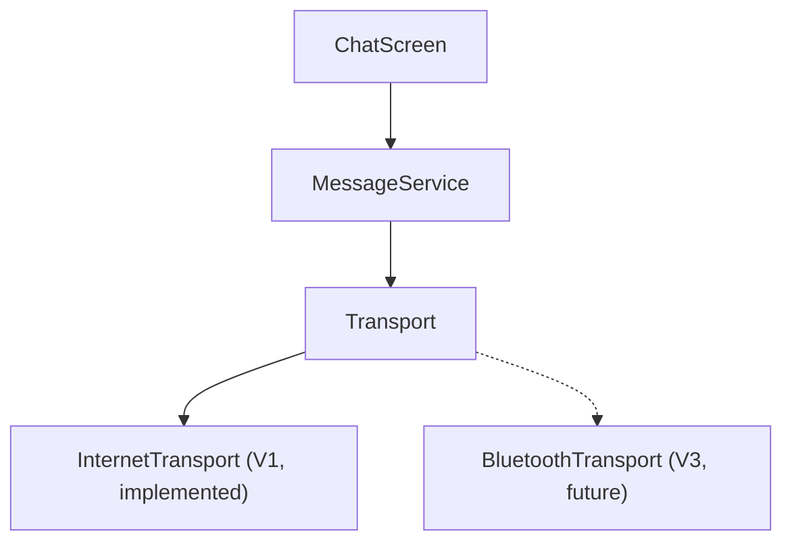

# Architecture

Diagrams updated as the system grows. Additive — don't rewrite existing diagrams from scratch when a phase adds structure, extend them.

## System architecture (V1)

## Message flow (V1)

## Connection state machine

Leave model (Stage E) overrides spec §25's passive auto-expire: it is a deliberate, **solo-completable 5-step countdown**, one step per 24h (server-gated), tracked per-member on `connection_members.leave_step` / `leave_last_step_at`. Silence keeps the connection; a member can always exit alone by completing their own 5 steps; when both are leaving, either can `confirm-end` immediately. Chat reflects leave state via a banner + system lines by polling `/connections/current` (leave is connection state, deliberately kept out of the message `Transport`).

**Termination deletes the conversation**: reaching `terminated` deletes the `connections` row, which cascades (`on delete cascade`) to `connection_members` and `messages` — nothing is retained server-side. Participants export (TXT / JSON / HTML) before leaving; the data is theirs. Read receipts: `connection_members.last_read_at`; a sender's message is "Seen" once the other member's `last_read_at ≥ its created_at`, surfaced via the same `/connections/current` poll.

## Transport abstraction

Load-bearing for V3/V4 — every client message path routes through this, not directly through Socket.IO.

