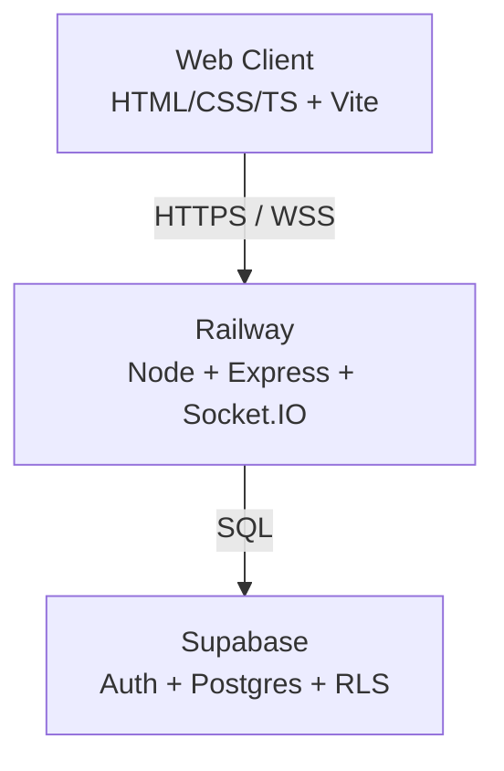
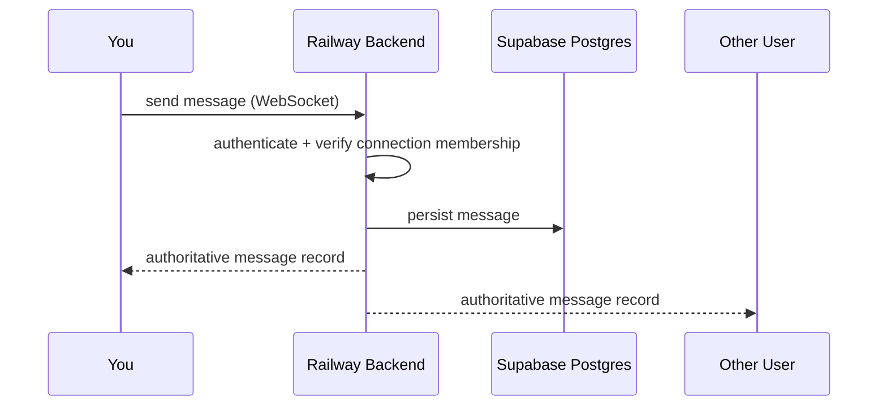
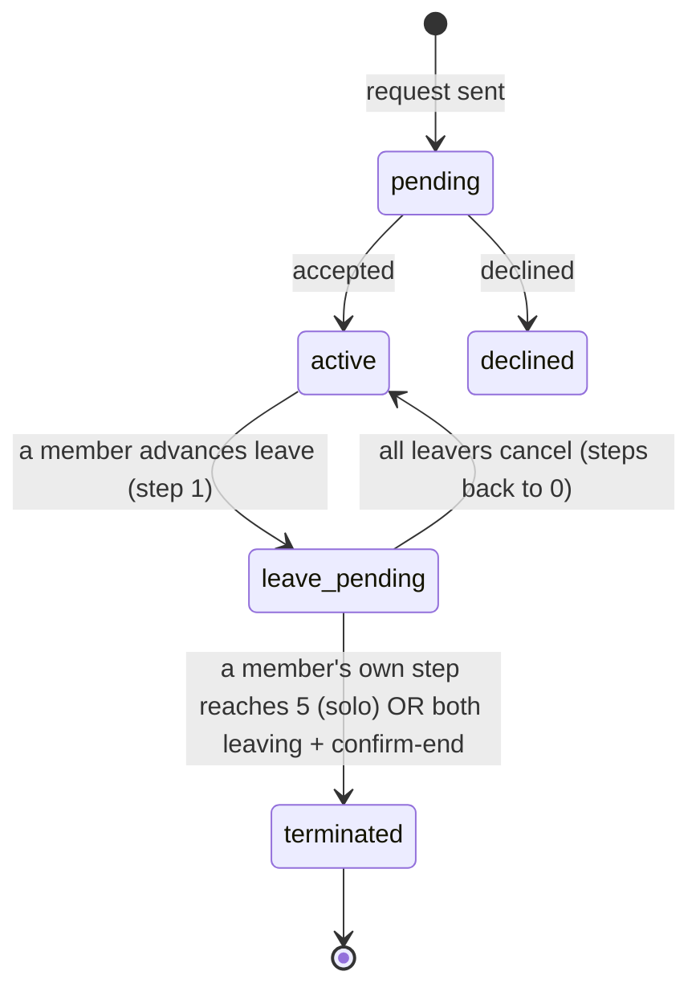
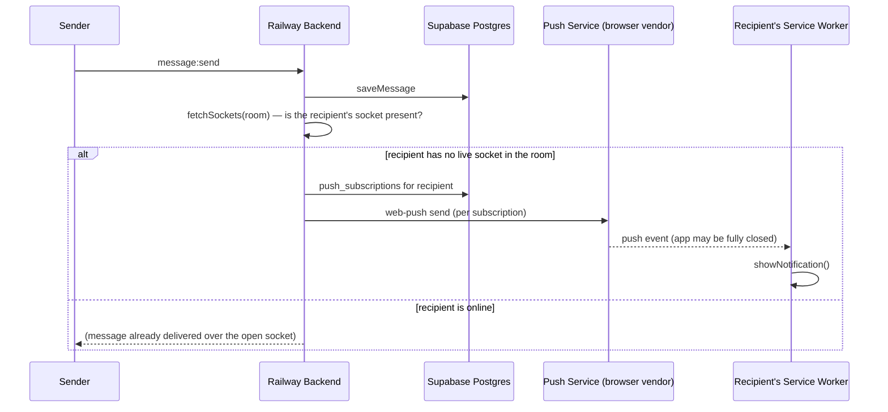
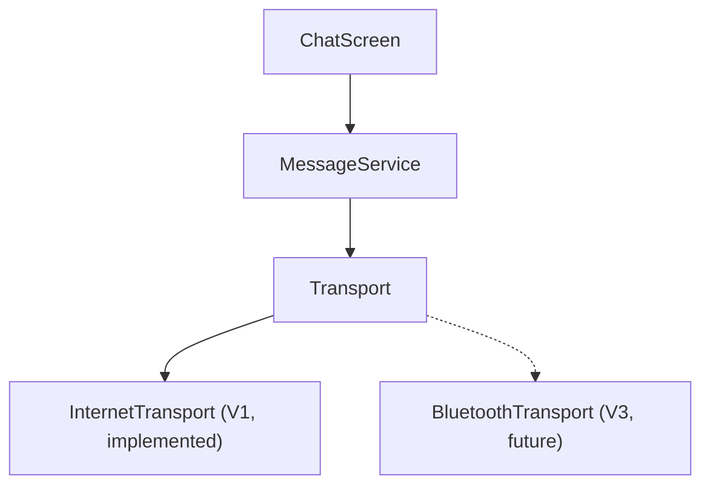

# Architecture

Diagrams updated as the system grows. Additive — don't rewrite existing diagrams from scratch when a phase adds structure, extend them.

## System architecture (V1)

## Message flow (V1)

**Message types (since 2026-08-27):** a message carries `type` ('text' | 'letter' | future 'voice') + `payload` (jsonb) alongside `content`. The whole pipeline (`saveMessage` → socket → `Transport.sendMessage(content, type?, payload?)` → `IncomingMessage`/`HistoryMessage` → `appendMessage`) threads these additively, so new types don't re-plumb the flow. **Letters:** body in `content`, `{ appearance, from, to }` in `payload`; rendered as a folded card that opens a styled letter (downloadable as HTML). **Slash commands** (`/letter`, `/shrug`, …) live client-side in `features/slashCommands.ts` — `/letter` is the only one that produces a special message.

**Replies (since 2026-08-27):** `messages.reply_to` (nullable FK to `messages.id`, `on delete set null`) rides the same pipeline — `Transport.sendMessage`'s optional 4th arg, threaded through `saveMessage`/socket/`IncomingMessage`/`HistoryMessage`. The backend re-validates the reply target is a real message in the same connection before storing (never trusts the client id, spec §20). Client-side, `ChatPage.ts` keeps an in-memory `messagesById` map (populated as messages render) to resolve a `reply_to` id into a "sender + snippet" quote block without a re-fetch. Triggering a reply: phone = right-swipe a row; desktop = right-click a row for a small context menu (`.chat__ctx-menu`, via a shared `openPopover()` helper) — the same menu reactions extend with a second "React" item.

**Reactions (since 2026-08-27, overrides spec §29's V1 non-goals — user-confirmed):** a separate `reactions` table (`message_id`, `user_id`, `emoji`, unique per triple) rather than piggybacking on `messages.payload`, since a message can carry many reactions from either member independent of who sent it. Not on the `Transport.sendMessage` path — a parallel `sendReaction`/`onReaction` pair on `Transport`, backed by socket events `reaction:add`/`reaction:remove` → broadcast `reaction:update`. `getHistory` attaches an aggregated `{emoji, userIds}[]` per message (via `reactionService.getReactionsForMessages`); live updates apply to an in-memory `reactionsByMessage` map and re-render just that message's chip row. Triggering: phone = long-press a message bubble; desktop = right-click a row — both open the same menu via the shared `openPopover()` helper. Since 2026-08-29 that helper measures the built menu and clamps it into the visual viewport (8px safe margin, flips above↔below the anchor, repositions on resize, dismisses on scroll) so the picker can never leave the screen or widen the document. The menu carries the 6-emoji row plus **Copy** (text only) and **Report**; desktop also gets **Reply** (phone replies via the right-swipe).

**Message reports (since 2026-08-29):** `message_reports` table (`message_id` nullable + `ON DELETE SET NULL`, `reporter_id`, `reason`, `message_content` snapshot, `unique (message_id, reporter_id)`, RLS enabled). `POST /api/messages/:id/report` (rate-limited) → `reportService.reportMessage`, which verifies the reporter was ever a member of the message's connection (not that it's still active — you report abuse *as* you leave), snapshots the message text, and treats a duplicate as success. No in-app moderation UI in V1 — rows are for manual review; satisfies the Play Store UGC reporting requirement.

**Hardening (2026-08-29 audit, batches 0–3):** single-active-connection is now enforced by partial unique indexes + an advisory-locked trigger (migration 016), not a racy `count(*)`; `getCurrentConnection` tolerates a stray extra row instead of locking the user out. Connection state transitions (accept / decline / cancel / advance-leave) are conditional updates that pin the from-state. `messages`/`connections` FKs to `users` cascade on delete (migration 017) so accounts can actually be deleted. `getHistory` is paginated newest-first with a `before` cursor. Push endpoints are host-allowlisted (anti-SSRF); connection codes are `crypto.randomInt`; `express-rate-limit` + a per-socket flood guard are in place; socket events re-resolve the caller's live connection per event rather than trusting the handshake value. Client: one reconnecting transport supervisor with ack timeouts and fresh-token socket auth; optimistic sends reconcile on a client `tempId` echoed in `message:new`; `ChatPage` tears down all body-level overlays + their listeners on navigation.

## Connection state machine

Leave model (Stage E) overrides spec §25's passive auto-expire: it is a deliberate, **solo-completable 5-step countdown**, one step per 24h (server-gated), tracked per-member on `connection_members.leave_step` / `leave_last_step_at`. Silence keeps the connection; a member can always exit alone by completing their own 5 steps; when both are leaving, either can `confirm-end` immediately. Chat reflects leave state via a banner + system lines by polling `/connections/current` (leave is connection state, deliberately kept out of the message `Transport`).

**Termination deletes the conversation**: reaching `terminated` deletes the `connections` row, which cascades (`on delete cascade`) to `connection_members` and `messages` — nothing is retained server-side. Participants export (TXT / JSON / HTML) before leaving; the data is theirs. Read receipts: `connection_members.last_read_at`; a sender's message is "Seen" once the other member's `last_read_at ≥ its created_at`, surfaced via the same `/connections/current` poll.

## Client appearance (V1, since 2026-08-27)

`features/appearancePreview.ts` persists `{ style, theme }` to localStorage (per-device) and toggles classes/attributes on `.chat` (`applyAppearance`), read by CSS in `styles/global.css`. Bubbles is the default `style`; `theme` (light/dark) only affects bubble-mode colors via `--bubble-mine-*`/`--bubble-other-*` custom properties, scoped under `.chat--bubbles[data-theme='light']`. The composer (`ChatPage.ts`) is a `<textarea>`, not `<input>`, so messages can carry blank-line paragraph gaps; `utils/linkify.ts` turns URLs/phone numbers into `<a>`/`tel:` links via text-node splitting (same XSS-safe pattern as the existing search highlighter).

**Wallpaper is shared, since 2026-08-27** — unlike style/theme, it's `connections.wallpaper` (migration 014), not localStorage: either member's pick applies to both. `appearancePreview.ts` takes it as a param (`applyAppearance(chat, wallpaper)`, `openAppearance(anchor, chat, wallpaper, onWallpaperChange)`) rather than owning it; `ChatPage.ts` applies it optimistically on change via `PATCH /connections/:id/wallpaper` (membership-checked) and re-syncs it off the existing 4s connection poll — no new socket event, reuses the same poll leave-state/read-receipts already ride. `wallpaper: 'love'` serves `client/public/love.jpg` and overrides the bubble palette (colors pulled from the artwork's own palette) so bubbles read against the art.

## Web Push notifications (V1, since 2026-08-27 — inert until keys are set)

A connection's Socket.IO room has exactly its two members, so "any other socket present" is a cheap proxy for "the recipient is here" — no separate presence table. `push_subscriptions` (migration 013) holds one row per device; a 404/410 from the push service prunes it. The client only subscribes when the user toggles **Notifications** in the `•••` menu (`features/pushNotifications.ts`) — never an automatic prompt. Requires `client/public/manifest.webmanifest` + `sw.js` (installable PWA — mandatory for iOS to deliver push at all) and VAPID keys set via env on both sides; unset keys make the backend no-op rather than fail sends.

## Transport abstraction

Load-bearing for V3/V4 — every client message path routes through this, not directly through Socket.IO.

